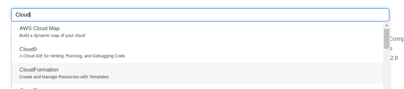
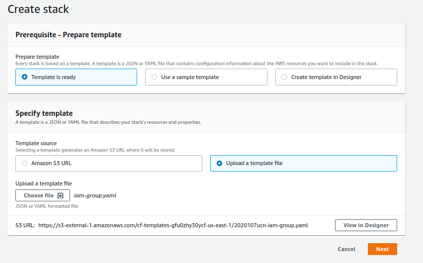
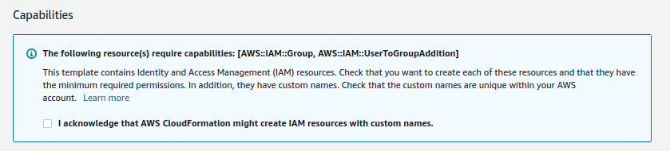
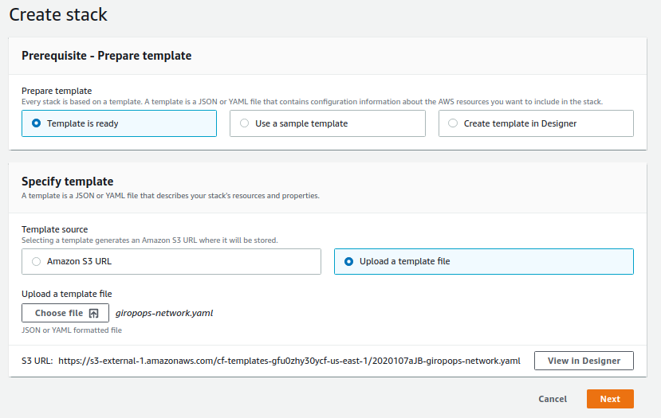
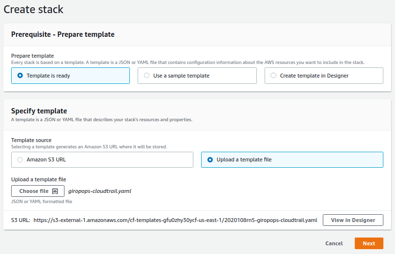
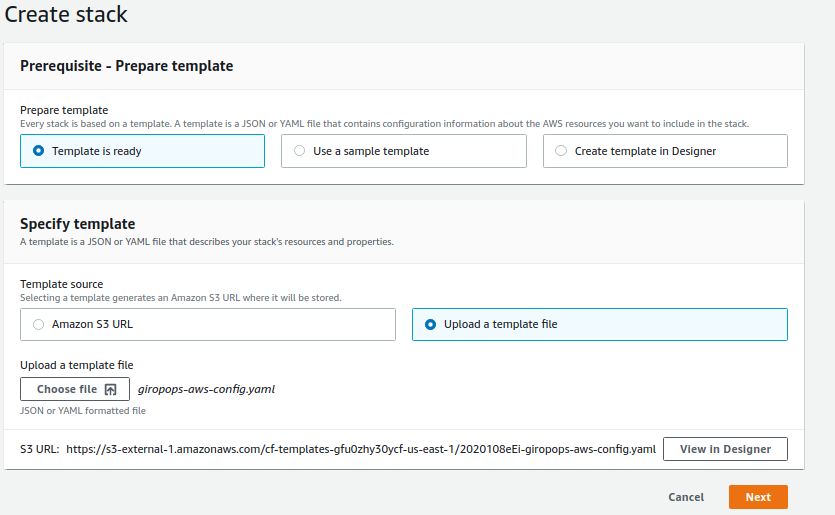

  

<h2 align="center">Desafio - Cloudformation</h2>

<h3 align="center">LinuxTips - Aws Expert - Turma 01</h3>

---

 Exercício de fixação dos conceitos e aprendizado do curso, com o foco na utilização do CloudFormation no conceito de IaC (Infra as Code)
      

## 📝 Conteúdo

- [Sobre](#about)
- [Iniciando](#getting_started)
- [Executando](#usage)
- [TODO](#todo)
- [Autor](#authors)

## 🧐 Sobre 

Utilizando o CloudFormation, precisamos que você crie o seguinte cenário:

- Criar um grupo de usuários no IAM, chamado Operations
- Criar iam role e 'attachar' a um grupo de usuários de Operação, com permissão PowerUsers
- Configurar o AWS Cloud Trail
- Habilitar as seguintes regras de AWS Config: required-tags, root-account-mfa-enabled, iam-password-policy e approved-amis-by-id
- Criar um VPC chamado Giropops
- Duas subnets, uma privada e outra publica
- Criar duas instâncias ec2 para funcionar como webserver (porta tcp 80) e 02 para que seja o nosso database (seria um database Postgresql)
- Em nossa subnet publica, teremos o nossos web servers
- Em nossa subnet privada, teremos os nossos databases
- Não esqueça do nosso security group!
- Nesse VPC, precisamos ter todos os componentes (NAT, GWs, Sec Group) necessários para que nossas subnets funcionem adequadamente.

## 🏁 Iniciando 

Para iniciar vamos realizar a criação do grupo e do usuário que poderá ser utilizado para executar o processo de automação. Em nosso exemplo o usuário criado será o **awsexpert**.

***Para esse desafio vamos utilizar somente o painel da Aws.***

### Prerequisites

Para executar a primeira operação é necessário que seja usando um usuário com policy **AdministratorAccess** ou o seu usuário da **conta de IAM** ou um usuário que tenha a policy **IAMFullAccess**

## 🎈 Executando 

### IAM Grupo e Usuário

#### Executando o script **iam-group.yaml** que está no diretório **iam** 

1) No Painel da AWS acesse o serviço CloudFormation

2) Clique no botão Create stack
3) Na tela seguinte selecine as opções conforme a imagem abaixo: 

4) Clique em Next
5) Informe o nome da stack por exemplo **iam-stack** e clique em next
6) Na proxima tela não vamos informar nada e assim vamos até o final dela e clicamos em next novamente
7) Na tela de review irá aparecer a imagem abaixo, selecione o checkbox e clique em Create stack

8) Acompanhe o processo até que o processo informe Create_Complete.
9) Acesse o IAM e verifique se o grupo e o usuário foram criados corretamente.

### Giropops VPC

#### Executando o script **giropops-network.yaml** que está no diretório **network** 

1) No Painel da AWS acesse o serviço CloudFormation
2) Clique no botão Create stack
3) Na tela seguinte selecine as opções conforme a imagem abaixo: 

4) Clique em Next
5) Informe o nome da stack por exemplo **giropops-network** e clique em next
6) Na proxima tela não vamos informar nada e assim vamos até o final dela e clicamos em next novamente
7) Na tela de review clique em Create stack
8) Acompanhe o processo até que o processo informe Create_Complete.
9) Acesse o serviço VPC e verifique se o giropops foi criado corretamente, bem como as duas instancias.

### CloudTrail

#### Executando o script **giropops-cloidtrail.yaml** que está no diretório **cloudtrail** 

1) No Painel da AWS acesse o serviço CloudFormation
2) Clique no botão Create stack
3) Na tela seguinte selecine as opções conforme a imagem abaixo: 

4) Clique em Next
5) Informe o nome da stack por exemplo **giropops-cloudtrail** e clique em next
6) Na proxima tela não vamos informar nada e assim vamos até o final dela e clicamos em next novamente
7) Na tela de review clique em Create stack
8) Acompanhe o processo até que o processo informe Create_Complete.
9) Acesse o serviço CloudTrail foi criado corretamente.

### AWS Config

#### Executando o script **giropops-aws-config.yaml** que está no diretório **awsconfig** 

1) No Painel da AWS acesse o serviço CloudFormation
2) Clique no botão Create stack
3) Na tela seguinte selecine as opções conforme a imagem abaixo: 

4) Clique em Next
5) Informe o nome da stack por exemplo **giropops-cloudtrail** e clique em next
6) Na proxima tela não vamos informar nada e assim vamos até o final dela e clicamos em next novamente
7) Na tela de review irá aparecer a imagem abaixo, selecione o checkbox e clique em Create stack

8) Acompanhe o processo até que o processo informe Create_Complete.
9) Acesse o serviço CloudTrail foi criado corretamente.

## 🔧 TODO 

- Corrigir a execução das stacks pelo usuário awsexpert, pois hoje não está sendo possível
- Realizar testes usando a linha de comando (AWS CLI)
- Incluir testes de Infra
- Automatizar as criações, para não ter que usar o painel e nem mesmo o cli

## ✍️ Authors 

- [@cesarsturion](https://github.com/cesarsturion)

